# 企业主机管理系统（Host Manager）

面向企业内网的主机资产与机房维度的统一管理后端：提供城市、机房、主机的全生命周期数据接口，支撑异步可达性探测、root 凭证密文轮转、按维度统计入库，以及全链路 API 耗时观测。技术栈为 **Django / Django REST framework**，异步与定时能力由 **Celery + Redis** 承担，持久化使用 **MySQL**。

---

## 功能概览

| 模块 | 能力说明 |
|------|---------|
| 主数据 | `City` → `IDC` → `Host` 层级建模；主机绑定机房，支持启用状态等业务字段 |
| 凭证 | `HostPassword` 仅存密文；新建主机时生成初始 root 密码并加密落库 |
| 运维探测 | 主机 **`ping`**：POST 异步入队 Celery，GET 携带 `task_id` 轮询结果；POST 侧限流（按客户端 IP / 按主机） |
| 定时任务 | 每 8 小时对符合条件的主机轮换 root 密码并更新密文记录；每日 00:00 按城市、机房分别统计活跃主机数并写入 `HostStatistic` |
| 可观测性 | `ApiCostMiddleware` 对 API 请求计时，经异步任务写入 `ApiCost`，便于耗时分析与排障 |

---

## 技术栈

| 类别 | 选型 |
|------|------|
| 运行时 | Python 3（建议 3.10+） |
| Web | Django 4.2、Django REST framework |
| 数据库 | MySQL（驱动：PyMySQL） |
| 缓存与会话 | Redis（django-redis） |
| 异步任务 | Celery 5、Redis 作为 Broker 与 Result Backend |
| 安全 | cryptography（Fernet 等可插拔加密器） |
| 配置 | python-dotenv（`.env` 加载） |
| 测试 | pytest、pytest-django |
| 部署（可选） | gunicorn |

---

## 仓库结构（节选）

```
.env.example              # 环境变量模板（可提交）
host_mgr/                 # Django 项目配置、路由、Celery、中间件、加密封装
  settings.py             # Celery Beat 调度、Redis/MySQL 等
  urls.py                 # API 路由前缀 /api/v1/
  tasks.py                # Celery 应用与任务（统计、轮换密码、ping、API 耗时）
  middleware.py           # 请求耗时中间件
  crypto/                 # 密码加密适配
city/                     # 城市应用
idc/                      # 机房应用
host/                     # 主机、密码、统计模型与视图
api_cost/                 # API 耗时记录模型与视图
tests/                    # 单元测试
manage.py
requirements.txt
```

---

## 系统架构

组件之间的关系如下（逻辑视图，部署时可合并或拆分进程）。**Django 进程**内通过 **Celery 应用**（`send_task` / `.delay`）向 Broker 提交异步任务；**Celery Worker** 进程独立运行，任务代码中仍使用 **Django ORM（models）** 访问 MySQL，与 Web 请求共用同一套模型定义。

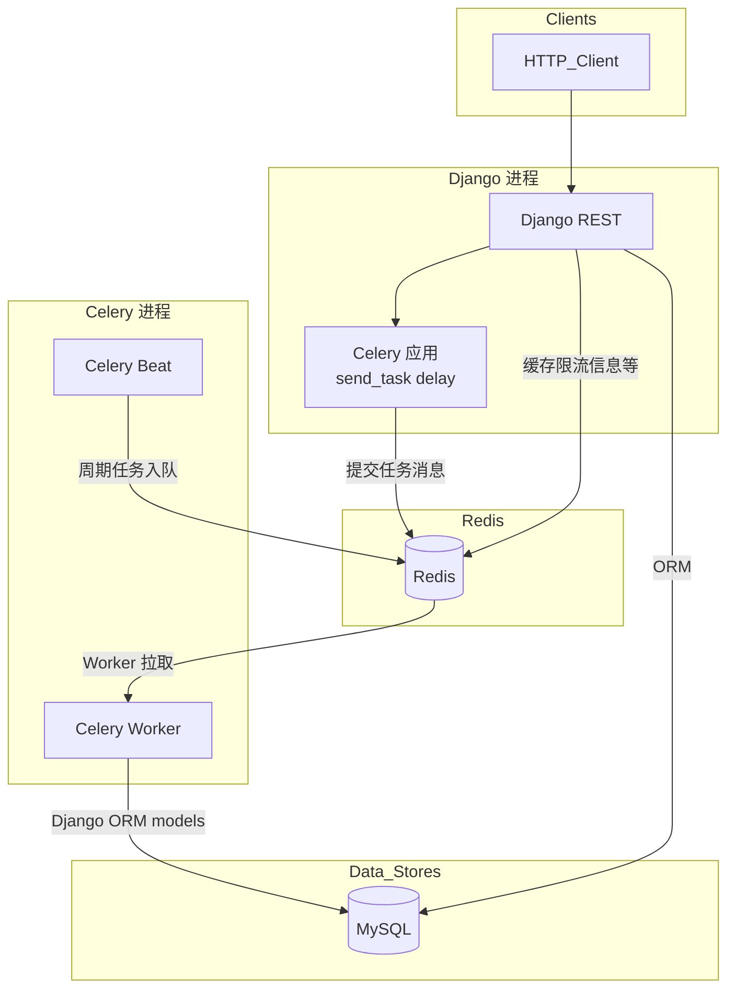

- **Django**：同步 HTTP、ORM、缓存/会话；业务代码通过 **同一 Celery 应用实例**将任务提交到队列（与 Worker 侧 `tasks` 模块对应）。  
- **Celery 应用**：运行在 Django 上下文中发消息，不替代 Worker 执行。  
- **Redis**：缓存/会话、Celery Broker 与 Result Backend。  
- **Celery Worker**：消费队列中的任务；任务函数内使用 **Django models** 读写 MySQL（需在进程中加载 `DJANGO_SETTINGS_MODULE`）。  
- **Celery Beat**：按 `settings.CELERY_BEAT_SCHEDULE` 向 Broker 投递周期任务。

---

## 配置与环境变量

### 配置文件约定

- **`.env`**：真实连接信息与密钥，仅存于本机或部署环境；已列入 `.gitignore`，**不会**进入版本库。这与 [Twelve-Factor App](https://12factor.net/config) 中「配置与代码分离」一致。  
- **`.env.example`**：仅含变量名与**占位值**，可安全提交，供新人或新机器「复制后修改为 `.env`」；与多数开源后端项目（Django、Rails、Node 等）惯例相同。  
- **CI / 生产**：在流水线或云平台使用 **Secrets** / 密钥管理服务注入同名环境变量，无需也不会使用仓库内的 `.env` 文件。

### 使用 `.env.example` 快速初始化

在项目根目录执行（按操作系统任选其一）：

```bash
cp .env.example .env
```

Windows CMD：`copy .env.example .env`；PowerShell：`Copy-Item .env.example .env`。

然后编辑 `.env`：将 MySQL/Redis 信息改为实际值，并生成并填入 **Fernet** 可用的 `HOST_PASSWORD_ENCRYPTION_KEY`（生成方式见 `.env.example` 内注释）。

### 环境变量说明

| 变量名 | 必填 | 说明 |
|--------|------|------|
| `DB_NAME` | 是 | MySQL 数据库名（须与库中已创建库名一致） |
| `DB_USER` | 是 | MySQL 用户名 |
| `DB_PASSWORD` | 是 | MySQL 密码 |
| `DB_HOST` | 是 | MySQL 主机地址 |
| `DB_PORT` | 是 | MySQL 端口 |
| `REDIS_HOST` | 是 | Redis 主机 |
| `REDIS_PORT` | 是 | Redis 端口 |
| `REDIS_PASSWORD` | 否 | Redis 密码；为空时按无密码连接 |
| `REDIS_DB` | 是 | Django 缓存使用的 Redis DB 编号 |
| `REDIS_DB_CELERY` | 是 | Celery Broker/Result 使用的 Redis DB 编号 |
| `HOST_PASSWORD_ENCRYPTION_KEY` | 是 | 主机 root 密码加密密钥（与所选加密器匹配） |
| `HOST_PASSWORD_ENCRYPTOR` | 否 | 加密器类路径，默认 `host_mgr.crypto.adapters.FernetEncryptor` |
| `CELERY_TIMEZONE` | 否 | Celery 时区，默认 `Asia/Shanghai` |

---

## 本地运行

### 前置条件

- **MySQL**：已安装并启动；**已创建空库**（见下节），字符集建议 `utf8mb4`，排序规则常用 `utf8mb4_unicode_ci`。  
- **Redis**：可访问；缓存与 Celery 使用不同 logical DB（与 `.env` 中 `REDIS_DB`、`REDIS_DB_CELERY` 一致）。  
- **Python**：建议使用虚拟环境。

### 创建数据库

在 MySQL 中执行（库名、用户请与 `.env` 中一致，密码按需替换）：

```sql
CREATE DATABASE host_mgr
  DEFAULT CHARACTER SET utf8mb4
  DEFAULT COLLATE utf8mb4_unicode_ci;

-- 若使用独立业务账号（推荐），示例：
-- CREATE USER 'host_mgr'@'%' IDENTIFIED BY 'your_password';
-- GRANT ALL PRIVILEGES ON host_mgr.* TO 'host_mgr'@'%';
-- FLUSH PRIVILEGES;
```

也可使用图形化客户端创建同名库并指定 `utf8mb4`。

### 安装依赖

```bash
pip install -r requirements.txt
```

### 数据库迁移

```bash
python manage.py migrate
```

### 启动 Web（开发）

```bash
python manage.py runserver
```

默认 API 前缀：`http://127.0.0.1:8000/api/v1/`（与 `REST_API_PRE_URL`、`urls` 配置一致）。

### 启动 Celery Worker

```bash
celery -A host_mgr worker -l info
```

### 启动 Celery Beat（定时任务）

```bash
celery -A host_mgr beat -l info
```

生产环境可使用 **Gunicorn** 等 WSGI 服务器托管 Django，Worker/Beat 可用进程管理器或 systemd 守护。

---

## API 说明

全局前缀：`/api/v1/`（`api/` + `v1/`）。以下为主要 HTTP 接口一览（DRF Router 生成的列表/详情等资源路径遵循 ViewSet 约定）。

| 资源 / 能力 | 方法 | 路径 | 说明 |
|--------------|------|------|------|
| 城市 | GET / POST | `/api/v1/cities/` | 列表、创建 |
| 城市 | GET / PUT / PATCH / DELETE | `/api/v1/cities/{id}/` | 详情、更新、删除 |
| 机房 | GET / POST | `/api/v1/idcs/` | 列表、创建 |
| 机房 | GET / PUT / PATCH / DELETE | `/api/v1/idcs/{id}/` | 详情、更新、删除 |
| 主机 | GET / POST | `/api/v1/hosts/` | 列表、创建（创建时生成并加密初始 root 密码记录） |
| 主机 | GET / PUT / PATCH / DELETE | `/api/v1/hosts/{id}/` | 详情、更新、删除 |
| 主机 Ping | POST | `/api/v1/hosts/{id}/ping/` | 异步入队探测；通常 **202**，响应含 `task_id`、`status: queued` 等；入队失败时仍 **200** 且 `reason` 说明；**限流：按客户端 IP + 按主机（默认 10 次/分钟量级）** |
| 主机 Ping | GET | `/api/v1/hosts/{id}/ping/?task_id=...` | 轮询任务状态与 `reachable`；缺省 `task_id` 返回 **400**；**限流：轮询不限流** |
| 主机统计 | GET / POST 等 | `/api/v1/hosts/statistics/` | 按城市/机房维度落库的统计数据（ViewSet 标准路由） |
| API 耗时 | GET / POST 等 | `/api/v1/api-costs/` | 中间件异步写入的请求耗时记录 |

---

## 流程与交互

### Ping 探测时序（POST 入队 + GET 轮询）

**轮询逻辑（与实现一致）**：客户端用 POST 拿到的 `task_id` 反复 GET 同一主机的 ping 地址。服务端对 `AsyncResult(task_id)` 取 Celery `state` 分支处理：

- **无 `task_id` 查询参数**：**400**，`reason = task_id_required`。
- **`state` ∈ {`PENDING`, `RECEIVED`, `RETRY`}**：**200**，`reachable = false`，`reason = pending`（任务未执行或仍在队列）。
- **`state = STARTED`**：**200**，`reason = started`（执行中）。
- **`state = SUCCESS`**：若 `result` 为 dict 且 `host_id` 与 URL 中主机一致，则响应体为任务返回的探测结果（含 `reachable` 等）；否则 **200**，`reason = internal_error`。
- **其它状态**（如失败态等）：**200**，`reason = internal_error`。

POST 入队失败时不会返回 `task_id`，为 **200** 且 `reason = internal_error`（与成功入队的 **202** 区分）。

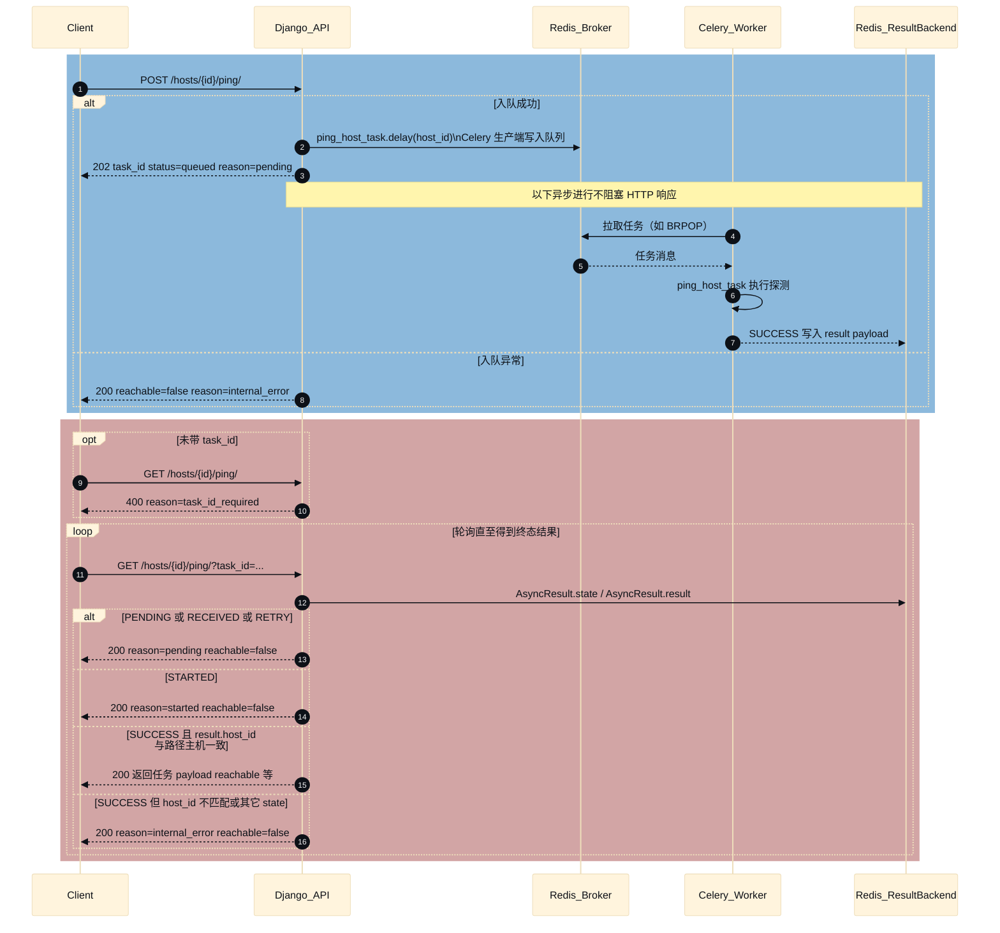

### 请求耗时中间件

说明：Django 进程内调用 `record_api_cost.delay(...)` 时，由 **Celery 客户端**把任务消息写入 **Broker（Redis）**；**Worker 进程**独立运行，从 Broker **拉取/消费**任务后再执行并写库，并非 Broker 主动“通知”Worker。

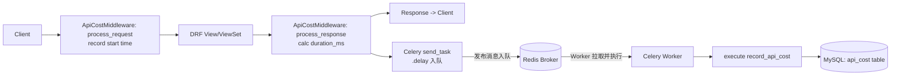

仅当请求路径以 `/api/` 开头时才会异步记录（与 `REST_API_PRE_URL` 一致）。

### 定时任务（Beat）

说明：**Celery Beat** 按调度将任务消息写入 **Broker**；**Worker** 从 Broker **拉取**任务执行。下方分别展开两个周期任务的**内部逻辑**（与 [`host_mgr/tasks.py`](host_mgr/tasks.py) 实现一致）。

**`compute_daily_host_statistics`**：在内存中按城市、按机房各做 **ORM 聚合 Count**（仅统计 `is_active` 主机），并通过 **`django.contrib.contenttypes.models.ContentType`** 将「城市 / 机房」统一映射到 `HostStatistic(content_type, object_id)` 同一张统计表；随后使用 **`bulk_create(..., batch_size=500, ignore_conflicts=True)`** 批量落库，避免逐条 `INSERT`。

**`rotate_host_root_passwords`**：先筛出「当前密码已生效满 8 小时」的主机（`HostPassword.is_current=True` 且 `valid_from ≤ now−8h`），并与 **`Host.is_active=True`** 求交；再经 **asyncio 协程**（带信号量限流）对每台主机执行 ping → 改密 → **加密**；仅成功的主机进入 **`transaction.atomic`**：**批量**将旧 `is_current` 行置为失效并写 `valid_to`，再 **`bulk_create`** 新密码行；失败主机仅打日志，不参与落库。

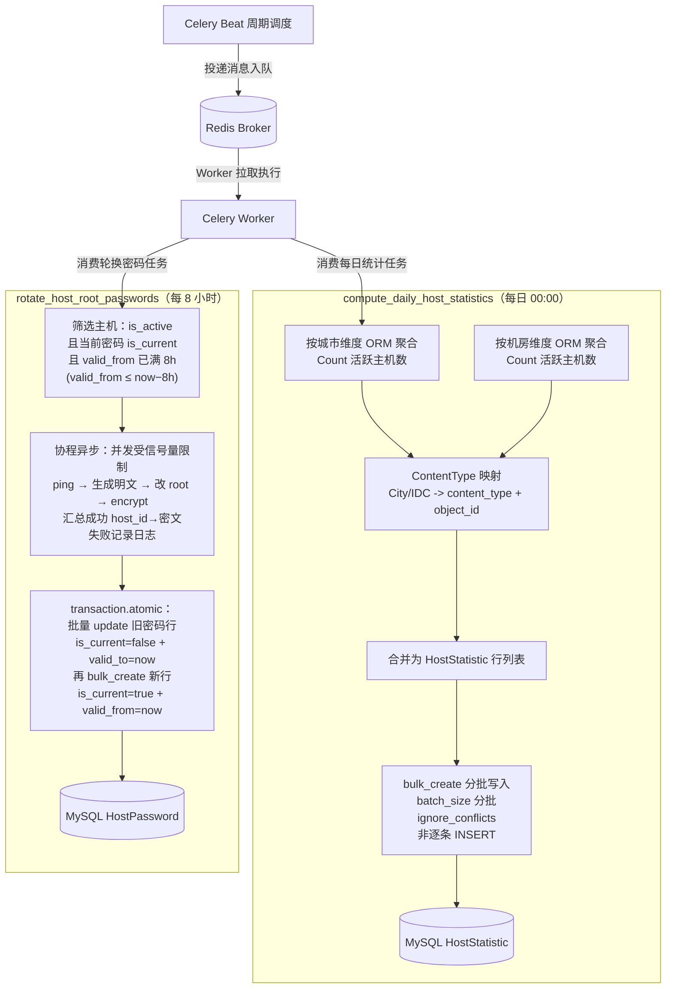

---

## 运行测试

项目使用 **pytest**；测试配置使用 [`host_mgr.settings_test`](host_mgr/settings_test.py)（SQLite 内存库、Celery 同步执行等），**无需**本机 MySQL/Redis 即可运行单元测试：

```bash
python -m pytest tests
```

---

## 演示

### Ping 异步探测（202 + task_id，GET 轮询结果）

#### 提交ping检测任务
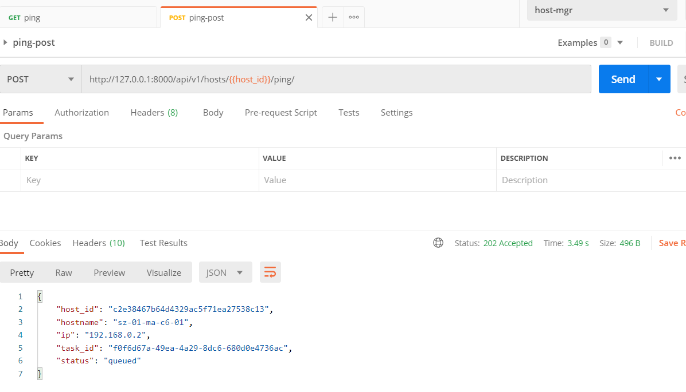
#### ping任务提交限流
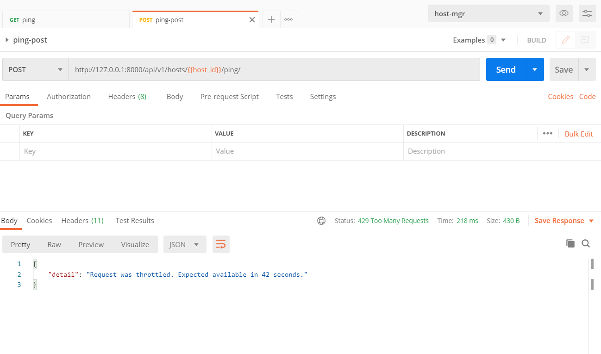
#### 查看ping任务执行结果
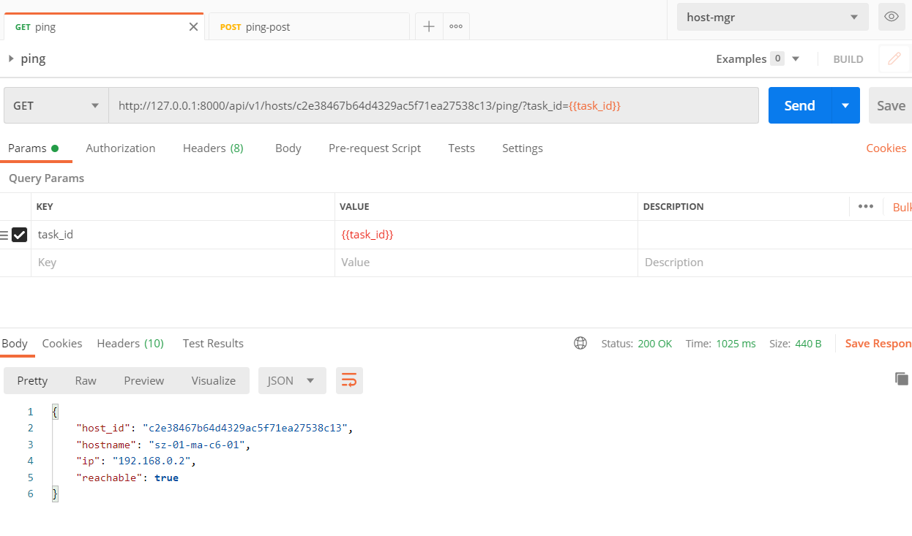

### Celery 任务与定时任务

#### worker 异步执行ping检测任务 && 异步记录api耗时任务
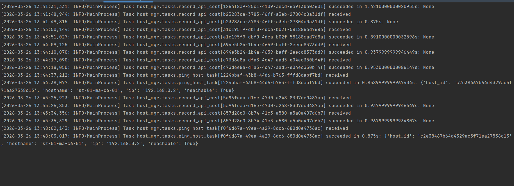
#### beat 定时触发密码更新任务 && 定时触发统计主机数量任务
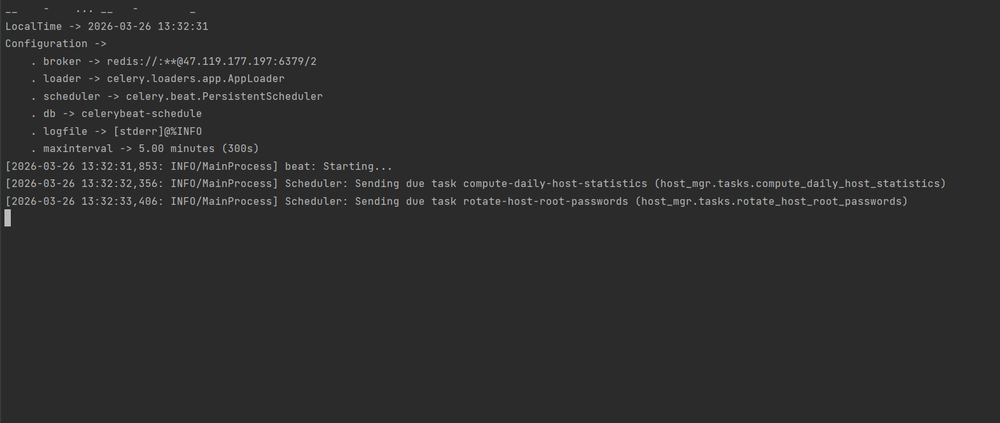

### 主机统计查询
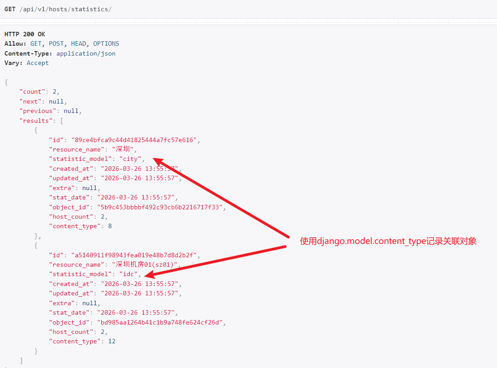


### 其他模型操作演示
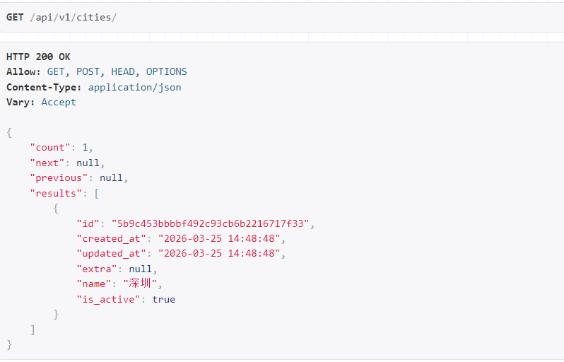
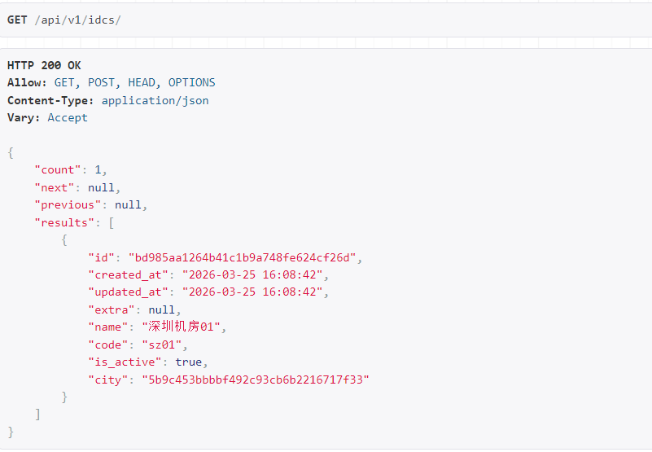
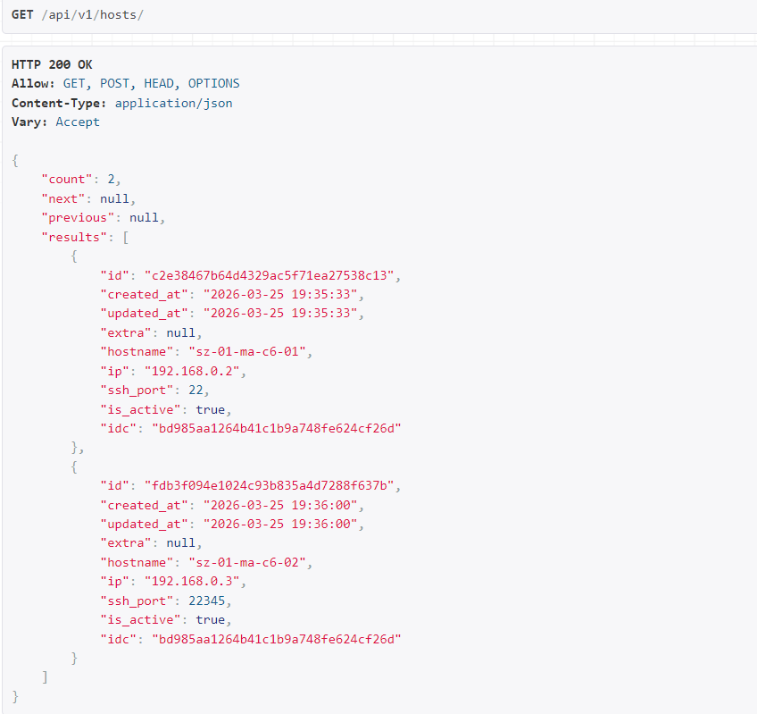
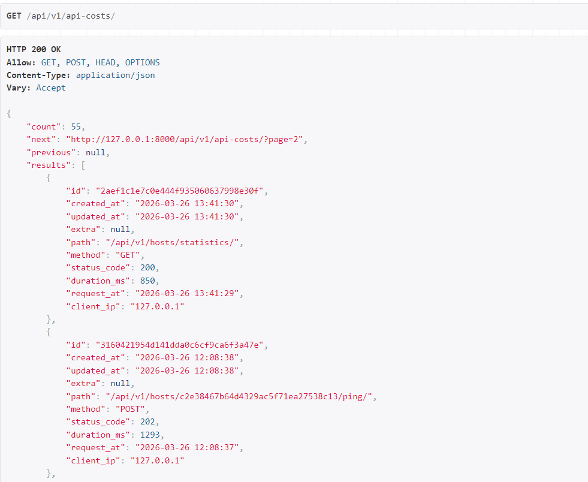

---

## 后续规划

- **配置外置**：已将敏感连接放在 `.env`；计划将 `SECRET_KEY`、`DEBUG`、`ALLOWED_HOSTS` 等同样收口到环境变量，便于多环境配置与密钥轮换。  
- **观测与运维**：计划接入统一健康检查（MySQL / Redis / Celery）；对密码轮换、日统计等任务增加指标埋点与失败告警通道。  
- **协作与交付**：已通过 `.env.example` 降低上手成本；计划按需补充 OpenAPI 导出或简短集成文档，方便对接方自助联调。
---
